# GW2 Rotation Helper - Master Your Rotation at the Training Golem

This tool shows in-game the rotation from the Snow Crows benchmark DPS reports.  
It will always show the last 2 skills, the current skill, and the next 7 skills.  
Depending on which skill the user activates, the GUI will proceed onwards in the rotation.

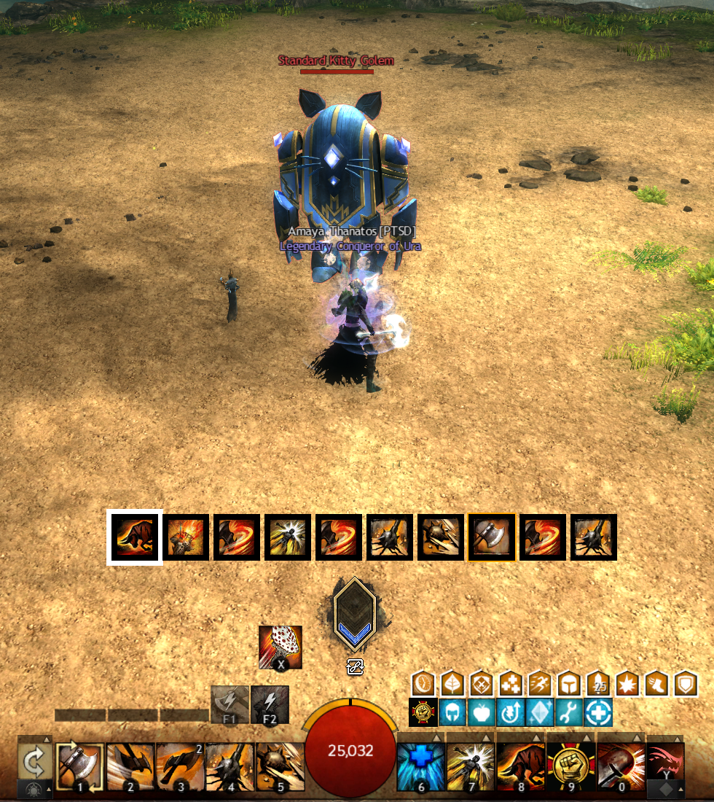

## ✨ Installation Guide

1. **Install Nexus**: Install Nexus Addon Manager
2. **Install ArcDPS**: Install arcdps via the Nexus Addon Manager
3. **Install this Addon**: Obtain the DLL either by
   1. Ingame in the nexus addon library
   2. The GitHub release [page](https://github.com/franneck94/GW2_RotaHelper/releases), there you need to place the dll in the GW2/addons dir

## 🎯 User Guide

#### Selecting a Rotation

- The addon ships exported benchmark rotations from the Snow Crows website.
- You can input a filter text; otherwise, all are listed for the currently selected profession.

   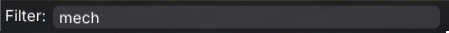

   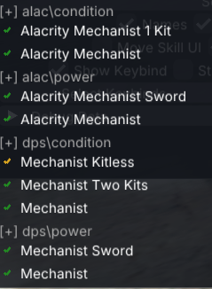

- There's a vertical and a horizontal layout depending on your needs.
- Skill names and cast times from the bench log can be turned on.

   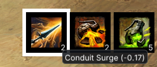

#### Important Notes

- The addon is only active in the Aerodrome and in the training area.
- This addon does not do any memory reading by itself it just uses the public ArcDPS API which has its limitations (see [here](#arcdps-public-api-limitations))
- The rotation starts at the first time point where damage is dealt to the enemy; hence, pre-cast abilities are excluded.

#### Visual Learning System

- White Border: Current skill to cast
- Orange Border: Auto-attack skills
- Greyed Icons: Skills that do no damage or are not forwarded by the public ArcDPS API

   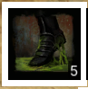
   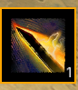
    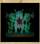

#### Features and Options

   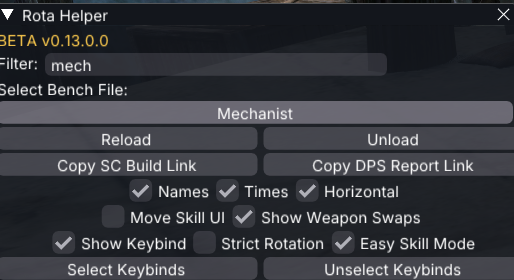

Note: Most features and settings have a detailed tooltip if you hover over it in-game.

##### Keybinds

- You can turn on the option to show the default keybinds for the skills.

   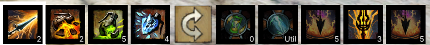

- Furthermore, you can even load in your custom keybinds via the XML file in:  
C:\Users\XXX\Documents\Guild Wars 2\InputBinds

   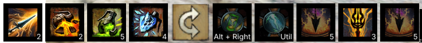

##### Copy to Clipboard

You can copy the following data to the clipboard:

- Link to the SC Build Guide
- Link to the Dps.Report

##### Rotation Settings

- Strict Rotation: Every skill has to match, so there is no room for skill swapping like 2->3 instead of 3->2.
  - The logic for greyed out skills still applies here
  - Not recommended for most builds.
- Easy Skill Mode: On certain classes, some skills are not shown. Examples:
  - F-Skills on Mechanist
  - Sword Auto Attack on Condi Renegade/Conduit

Regular Mode:

   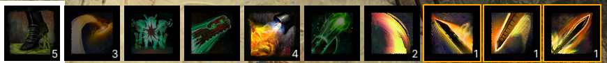

Easy Mode:

   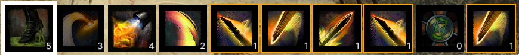

#### Tested Builds

In general, you can see in-game the state of a build.

- Working builds are marked with a green ✔️
- Okayish working builds are marked with a yellow ✔️
- Poorly working builds are marked with an orange 🗙
- Very bad working builds are marked with a red 🗙
- Not yet tested builds are marked with a gray  ❔

   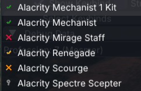

#### Converting your own logs

You can convert your own HTML logs from dps.report or other sources using the provided Python scripts:

1. **Setup Python Environment** (if not already installed):
   - Install Python 3.10+ from [python.org](https://python.org)
   - Install required dependencies: `pip install -r scripts/requirements.txt`

2. **Add manual Log List**
   - Add your dps.report http link to: internal_data/manual_log_list.json

3. **Download HTML Logs**:
   - Run: `python scripts/get_html_logs.py --manual`
   - This will download HTML logs and save them in the `internal_data/html/` directory.

4. **Convert to JSON Format**:
   - Run: `python scripts/html_log_to_json.py`
   - This converts the HTML logs to the JSON format used by the addon.
   - Converted files are saved in the `data/bench/` directory.

5. **Install Your Custom Rotations**:
   - Copy the generated JSON files to your addon's bench folder.

## ⚠️ Known Limitations

Full list of issues: [here](ISSUES.md)

### ArcDPS Public API Limitations

There are a few skills that either do no direct damage to the golem or only delayed damage, which means they don't trigger through the ArcDPS combat event system. These skills appear greyed out in the rotation helper to indicate they won't advance the rotation automatically.

1. **Cast it manually** - The skill is part of the optimal rotation but won't be automatically detected
2. **Don't wait** - Continue with the next skill in sequence immediately after casting
3. **Visual indicator only** - The grey tint helps you identify which skills need manual progression

This limitation is inherent to the ArcDPS public API, which only forwards combat events that deal damage to enemies. Support skills, buffs, and defensive abilities don't generate these events.
A list of such skills can be found [here](https://github.com/franneck94/GW2_RotaHelper/blob/main/src/SkillData.cpp#L147)

NOTE: Since i have no clue about reverse engineering i cannot do the skill detection by myself.

## 💬 Support & Feedback

Encountered an issue or have suggestions for improvement? We'd love to hear from you! Reach out via Discord or submit a detailed GitHub issue to help us enhance your experience.
